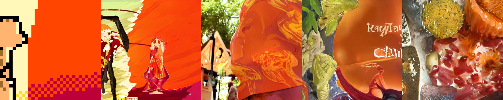

# r/Place to StableDiffusion

This project was issued to me as a challenge by [@mathieugalle](https://github.com/mathieugalle).

The script load StableDiffusion v1.4 or v1.5 and both currently existing canvas from [r/Place](https://www.reddit.com/r/place/), grab a random 32x32 slice from either of them, resize it to 512x512 and pass it to StableDiffusion's image2image pipeline with no textual prompt, then repeats this 3 times, using the output as the next input.

The user can repeat the process as many times as desired before closing the script.

The script can run on a 4GB VRAM GPU. Once the model is loaded, the image generation takes about 10 seconds.

**<span style='color:red;'>/!\\ Warning: The NSFW filter is disabled in this project to get around false positives /!\\</span>**

---
### Changelog

<details>
<summary>Version 1.0</summary>
- Initial Release<br>
</details>

<details>
<summary>Version 1.1</summary>
- ADD: Option to choose which model to load upon launching the script<br>
- ADD: Support for Stable Diffusion 1.5<br>
- CHANGE: the size of slices taken from r/Place canvas from 64x64 to 32x32<br>
- CHANGE: Inference steps revert back to default<br>
- CHANGE: Resize with `Image.Resampling.NEAREST`<br>
- FIX: Change strengh from 0.95 to 0.05<br>

</details>

---
### Instalation:

*Requires Python 3.8 or Python 3.9*
<details>
<summary>Instalation Instructions</summary>

Clone the repository on your machine, then run the following command to install all dependencies:
```bash
pip install -r requirements.txt
```
Then login with your huggingface account with the command (required to download the weights):
```bash
huggingface-cli login
```
From that point, you can either run `main.py` and let it download the weights from huggingface automatically. Or if you prefer, you can download them manually with either of the following command:
```bash
# For Stable Diffusion 1.4
git clone https://huggingface.co/CompVis/stable-diffusion-v1-4
# For Stable Diffusion 1.5
git clone https://huggingface.co/runwayml/stable-diffusion-v1-5
```
</details>


---
### Example
*Disclaimer: Those examples are cherry-picked*

<details>
<summary>Examples</summary>




</details>

---
### Post-Mortem

<details>
<summary>Version 1.0</summary>
This project has been for me the occasion to learn how to download and run a model hosted on Huggingface programtically and some basic image manipulation.

It also required a slight amount of optimization by loading the model only once, since this is the most time-consuming task, and then use it as many times as desired.

This is also my first time writing a proper README, and while I can sense there are still improvements to be made, this is a nice practice of communication skills.

I believe there should be as little steps as possible required for a user to run a script, which is why I aimed for only `huggingface-cli login` to be required for setup, and `python main.py` to run it.

In terms of improvement, I could probably wrap the entire thing in a class so that another library could use it programatically without having to load the model if they don't. For instance, if this is used as a command for a discord bot, it is unnecessary to load the model if it turns out no users call the command while the bot is running.<br>
I could perhaps have better results if I tweak the parameters a little more, 10 inference steps seems like a sweet spot, but 15 or 20 might yield better retults, the default however would often try too hard to give realistic results, while less than 10 steps barely change the input image.
</details>

<details>
<summary>Version 1.1</summary>
Well, one day after after pushing this project here. I found out Stable Diffusion 1.5 was now a thing. I'm not sure how much better it is, but I do get better results overall with it.

I also came to the realisation that I was using the Strengh parameter wrong when using the model, since I thought it meant how much I'm trying to preserve the original image, rather than how much noise I add onto it. So changing it from 0.95 to 0.05 drastically reduced the issue of changing the original image too much.

I didn't like that using a local model required editing one line in the code so I added a model selection at the start, leaving the option to use Stable Diffusion 1.4 as well since 1.5 seems to take an insanely longer time to download for the first time due to the large checkpoints file.

I also changed the amount of steps back to default since changing the strench helped avoiding the AI straying too much. And choose to take slices of 32x32 from the r/Place canvas instead of 64x64 since it seems to have less messy results overall.<br>
Following [@mathieugalle](https://github.com/mathieugalle)'s suggestion, I've also added `Image.Resampling.NEAREST` as an argument to Pillow's resize function.

If I'm going to update this further, I'll probably try to look into fine-tuning the model, in which case I'll probably release the fine-tuned model in the repository as well as removing the recursion.
</details>