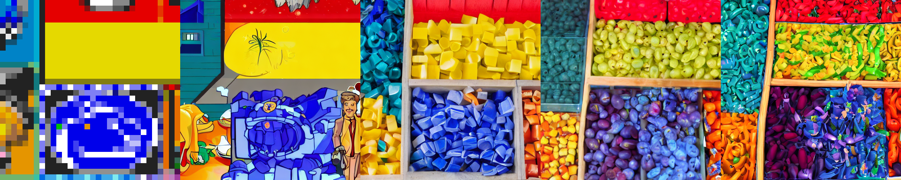

# r/Place to StableDiffusion

This project was issued to me as a challenge by <a class="user-mention" data-hovercard-type="user" data-hovercard-url="/users/mathieugalle/hovercard" href="/mathieugalle">@mathieugalle</a>.

The script load StableDiffusion v1.4 and both currently existing canvas from [r/Place](https://www.reddit.com/r/place/), grab a random 64x64 slice from either of them, resize it to 512x512 and pass it to StableDiffusion's image2image pipeline with no textual prompt, then repeats this 3 times, using the output as the next input.

The user can repeat the process as many times as desired before closing the script.

The script can run on a 4GB VRAM GPU. Once the model is loaded, the image generation takes about 10 seconds.

**<span style='color:red;'>/!\\ Warning: The NSFW filter is disabled in this project to get around false positives /!\\</span>**

---
### Instalation:
*Requires Python 3.8 or Python 3.9*

Clone the repository on your machine, then run the following command to install all dependencies:
```
pip install -r requirements.txt
```
Then login with your huggingface account with the command (required to download the weights):
```
huggingface-cli login
```
From that point, you can either run `main.py` and let it download the weights from huggingface automatically. Or if you prefer, you can download them manually with the following command:
```
git clone https://huggingface.co/CompVis/stable-diffusion-v1-4
```
Then find and uncomment the following line in `main.py`
```python
# model_id = "./stable-diffusion-v1-4"
```

---
### Example
*Note: Those examples are cherry-picked*





---
### Post-Mortem
This project has been for me the occasion to learn how to download and run a model hosted on Huggingface programtically and some basic image manipulation.

It also required a slight amount of optimization by loading the model only once, since this is the most time-consuming task, and then use it as many times as desired.

This is also my first time writing a proper README, and while I can sense there are still improvements to be made, this is a nice practice of communication skills.

I believe there should be as little steps as possible required for a user to run a script, which is why I aimed for only `huggingface-cli login` to be required for setup, and `python main.py` to run it.

In terms of improvement, I could probably wrap the entire thing in a class so that another library could use it programatically without having to load the model if they don't. For instance, if this is used as a command for a discord bot, it is unnecessary to load the model if it turns out no users call the command while the bot is running.<br>
I could perhaps have better results if I tweak the parameters a little more, 10 inference steps seems like a sweet spot, but 15 or 20 might yield better retults, the default however would often try too hard to give realistic results, while less than 10 steps barely change the input image.